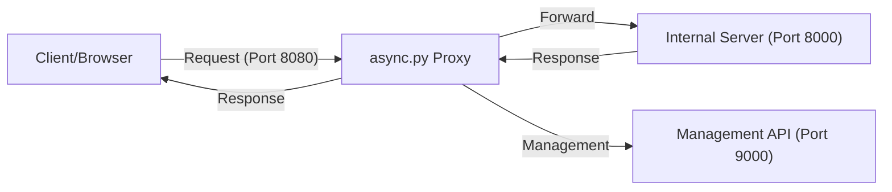

<<<<<<< HEAD
# async-proxy-server_with-_embedded-API
asyncio proxy server with 5 API endpoints
=======
# High-Performance Asyncio Proxy Server

A production-ready, asynchronous proxy server built with Python asyncio and aiohttp. Optimized for high concurrency with connection pooling, native management API, and real-time observability.

## 🚀 Getting Started

Follow these steps to deploy or test the proxy server:

1. **Environment Setup:**
   ```bash
   python -m pip install -r requirements.txt
   ```

2. **Configuration:**
   Copy the example environment file and update it with your settings:
   ```bash
   cp .env.example .env
   ```
   *Note: On Windows PowerShell, use `copy .env.example .env`*

3. **Launch the Proxy Server:**
   ```bash
   python async.py
   ```

3. **Optional: Mock Target for Testing:**
   In a separate terminal, launch the included mock server (port 8000):
   ```bash
   python mock_server.py
   ```

4. **Verify Deployment:**
   Use the demonstration script to confirm traffic forwarding:
   ```bash
   python demo_proxy.py
   ```

---

## 🛠️ Deployment

For production environments, it is recommended to use a process manager like **PM2** or **systemd** to ensure the server stays online.

### Process Management with PM2
```bash
pm2 start async.py --name "async-proxy" --interpreter python3
```

### Resource Requirements
- **Python**: 3.10+
- **Memory**: ~100MB (base), scales with connection pool size.
- **Port Access**: Requires ports `8080` (Proxy) and `9000` (Management API) by default.

---

## 🏗️ Architecture

The system utilizes a non-blocking asynchronous architecture for high-throughput request forwarding:



## 📡 API Endpoints

The management API provides real-time control and visibility into the proxy's performance.

### Health Check
Monitor the vital signs of the proxy instance.
- **Bash/CMD**: `curl http://localhost:9000/health`
- **PowerShell**: `Invoke-RestMethod -Uri http://localhost:9000/health`

### Live Statistics
Retrieve real-time metrics including total requests, uptime, and active connections.
- **Bash/CMD**: `curl http://localhost:9000/stats`
- **PowerShell**: `Invoke-RestMethod -Uri http://localhost:9000/stats`

### Dynamic Configuration
View or update server configuration (e.g., connection pool size) without a restart.
- **Get Config**: `curl http://localhost:9000/config`
- **Update Config**: 
  - **PowerShell**: `Invoke-RestMethod -Uri http://localhost:9000/config -Method Post -ContentType "application/json" -Body '{"max_connections": 250}'`

---

## 🔧 Maintenance & Performance

- **Connection Pooling**: Uses `TCPConnector` with configurable limits to maximize throughput.
- **DNS Caching**: Integrated 5-minute DNS TTL for reduced latency on repeated forwards.
- **Observability**: Built-in monitoring allows for rapid detection of bottlenecking or target failures.

## ⚠️ Troubleshooting

**Port Conflict Handling**
The server includes native detection for port conflicts. If port `8080` or `9000` is already occupied, the server will provide a clear error message instead of a stack trace. 

**Connection Refused**
Ensure the target server (default `localhost:8000`) is reachable from the proxy environment. Check firewall settings if deploying across networks.

## 🤝 Contributing & Support

Feel free to open issues or submit pull requests. For critical reliability questions, please consult the internal logging system logs generated by `async.py`.

---

## 📄 License

Distributed under the MIT License. See `LICENSE` for more information.
>>>>>>> abce1e3 (Initial git committed)
